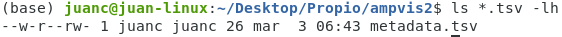

# Ejercicios de los permisos de Linux

## Problema 1 - Te encuentras navegando por los archivos **home** de tu computadora y mediante el comando **ls -lh** visualizas los permisos que tienen algunos archivos que de encuentran en el directorio de descargas

 ```bash
-rwx------ 1 juanc juanc 837K mar 27 03:32 informefinal.txt
-rwx------ 1 juanc juanc 934K mar 27 03:32 proteasa.pdb
```

Despues de visualizar las autorizaciones se te ocurre modificar el fichero de informefinal.txt ¿Es posible realizar alguna modificación?

### Respuesta

```bash
Si es posible, ya que presentamos permisos de lectura, escritura y ejecución como propietario, es por ello que podemos realizar modificaciones en los dos ficheros mostrados anteriormente.
```

## Problema 2 - Imagina que logras ingresar al escritorio de Roberto con el usuario Paulo (que no forma parte del grupo Solaria) y visualizas lo siguiente con el comando ls -l 

 ```bash
-rwxr-xr-x 1 Roberto Solaria 536K feb 19 00:00 primerparcial.md
```

### Complemento del Problema 2 - Supongamos que deseas mover primerparcial.md a un dispositivo USB como usuario Paulo ¿Puedes hacerlo de acuerdo con las autorizaciones proporcionadas?

### Respuesta

```bash
No, el usuario Paulo pertenece a la categoría "otros" y no tiene permisos de escritura en el fichero indicado. Es por ello que no podrá mover el archivo propuesto.
```

### Sistema binario 
# 

### Seguimiento el problema anterior - ¿Qué comando tendría que realizar el usuario Paulo para poder mover el fichero anteriormente indicado al dispositivo USB?

 ```bash
chmod +w
```

### ¿Qué comando tendría que proporcionar el usuario Paulo para realizar el permiso anterior sin modificar los los permisos que ya tenía establecidos Roberto al prncipio?

### Respuesta

Roberto tenía al principio los siguientes datos en el ficher primerparcial.md

```bash
-rwxr-xr-x 1 Roberto Solaria 536K feb 19 00:00 primerparcial.md 
```
Como propietario, Roberto presenta todos los permisos, los que pertenezcan al grupo Solaria tienen permisos de lectura y ejecución, lo mismo para el resto, en sistema octal está representado de la siguiente manera

```bash
755
```
Entonces se tiene que modificar los permisos del último número, el cual es el 5 (si los leemos de izquiera a derecha) debido a que es el número octal proporpocionado para aquellos que no pertenecen al grupo Solaria, el comando necesario sería el siguiente.

 
```bash
$ chmod 757
```

Con el comando anterior conservamos los permisos que estaban establecidos y únicamente añadimos permisos de escritura al resto para poder **mover** el archivo **primerparcial.md** a un dispostivo externo y podemos comprobarlo con el comando **ls -lh** 

```bash
-rwxr-xrwx 1 Roberto Solaria 536K feb 19 00:00 primerparcial.md
```

## Problema 3 - De acuerdo a la siguiente salida

 ```bash
drwxr-xr-- 1 Michel Grupo01 345K dec 28 13:17 Tareas 
```

Conforme a la salida de arriba ¿Qué tipo de fichero es? ¿Qué tipos de usuarios pueden ingresar a dicho fichero?

### Respuesta

 ```bash
Es un directorio porque al principio está representado con el simbolo "d". Únicamente el propietario Michel y los que pertenezcan a Grupo01 pueden ingresar al directorio de Tareas, el resto no tiene permisos de ejecución (pasar por).
```
¿Qué comando se debería de ejecutar para que cualquier usuario pueda ingresar al directorio Tareas sin modificar los permisos ya proporcionados en el fichero?

### Respuesta 

El directorio **Tareas** presenta todos los permisos, los que se encuentran dentro del **Grupo01** pueden leer e ingresar al directorio, el resto solamente puede leer. En sistema octal sería lo siguiente.

 ```bash
 754
```
Entonces el número octal que se debe de modificar es el **4** porque pertenece a los permisos del **resto** u **otros**. El comando a realizar es el siguiente.

 ```bash
$ chmod 755
```

La salida generada sería la siguiente 

 ```bash
drwxr-xr-x 1 Michel Grupo01 345K dec 28 16:00 Tareas 
```
## Problema 4 - Analiza la siguiente vista

# 

De acuerdo a los permisos implementados ¿Cómo estarían representados en sistema octal?

### Respuesta 

El documento **metadata.tsv** tiene permisos de escrituras para el **propietario** y **otros**, también existen permisos de lectura para el **grupo** y **otros**, entonces en sistema octal se representa como: 

 ```bash
246 
```
## Problema 5 - Dependiendo del tipo de usuario y con base a la siguiente salida

 ```bash
juanc@juan-linux:~/Desktop/ejemploficheros$ ls -lh
---x-wxrwx 1 juanc juanc 178K feb 12 19:41 proteina.pdb 
```
¿Qué permisos están asignados para cada usuario?

### Respuesta

 ```bash
El propietario tiene únicamente permisos de ejecución para el archivo "proteina.pdb", el grupo tiene permisos de escritura y ejecución y el resto presenta todos los permisos.
```

## Problema 6 - Representación en sistema octal

¿Cómo estarían representados en sistema octal los permisos proporcionados en el **Problema 5**?

 ```bash
chmod 137
```
## Problema 7 - Examina la siguiente salida 

 ```bash
juanc@juan-linux:~/Desktop/Propio/Octavo_Semestre$ ls -lh
d-wxr-xr-- 11 juanc juanc 4.0K jun 17  2021  cancermd
```
Con base a lo que hemos repasado, sabemos que es fichero **cancermd** es un directorio ¿Qué tipos de usuarios no pueden modificar el directorio **cancermd**? 

### Respuesta

 ```bash
Los usuarios asignados al grupo y el resto u otros no pueden modificar el directorio "cancermd".
```
## Problema 8 - Representación en sistema octal

¿Cómo se representaría en sistema octal los permisos asignados en la salida del **Problema 7**? 

### Respuesta 

 ```bash
354
```
## Problema 9 - Descripción de permisos proporcionados de acuerdo al sistema octal

De acuerdo a los siguientes números octales:

 ```bash
412
```
Describe los permisos asignados para cada tipo de usuario

### Respuesta 

 ```bash
El propietario solamente tiene permisos de lectura, el grupo únicamente tiene permisos de ejecución y el resto u otros nadamás pueden modificarlo. 
```
## Problema 10 - Tu turno

Piensa en algún archivo de tu computadora que sea demasiado importante para ti. 

* Ahora debes indicar, ya sea mostrándome la salida donde se encuentre dicho fichero valioso con el comando **ls -lh**. Ojo, la salida debe visualizar los permisos que quieras proporcionarte como **propietari@** los que gustes asignar al **grupo** y que permisos le das al **resto**.

* Escribe el comando completo que usaste para asignar ciertos permisos.

* Descríbeme cada número octal que usaste

### Posible respuesta  

 ```bash
juanc@juan-linux:~/Desktop/Propio$ ls -lh 
-rwxrw-r--  4 juanc Solaria 4.0K jul  7  2021  Proyecto_investigación.odt
```
### Comando utilizado para asignar permisos

 ```bash
chmod 764
```

### Descripción de los números octales utilizados 

* 7 -> asignado al propietario, presenta todos los permisos
* 6 -> asignado al grupo, pueden leer y modificar el fichero indicado
* 4 -> asignado al resto u otros, unícamente pueden leerlo

## Pregunta opcional - ¿Porqué decidiste aplicar esos permisos? ¿Qué significa ese documento para ti?


