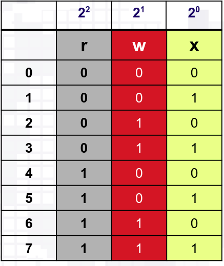

# Ejercicios de los permisos de Linux

## Problema 1 - Te encuentras navegando por los archivos **home** de tu computadora y mediante el comando **ls -lh** visualizas los permisos que tienen algunos archivos que de encuentran en el directorio de descargas

 ```bash
-rwx------ 1 juanc juanc 837K mar 27 03:32 informefinal.txt
-rwx------ 1 juanc juanc 934K mar 27 03:32 proteasa.pdb
```

Despues de visualizar las autorizaciones se te ocurre modificar el fichero de informefinal.txt ¿Es posible realizar alguna modificación?

### **Respuesta**

```bash
Si es posible, ya que presentamos permisos de lectura, escritura y ejecución como propietario, es por ello que podemos realizar modificaciones en los dos ficheros mostrados anteriormente.
```

## Problema 2 - Imagina que logras ingresar al escritorio de Roberto con el usuario Paulo (que no forma parte del grupo Solaria) y visualizas lo siguiente con el comando ls -l 

 ```bash
-rwxr-xr-x 1 Roberto Solaria 536K feb 19 00:00 primerparcial.md
```

### Complemento del Problema 2 - Supongamos que deseas mover primerparcial.md a un dispositivo USB como usuario Paulo ¿Puedes hacerlo de acuerdo con las autorizaciones proporcionadas?

### **Respuesta**

```bash
No, el usuario Paulo pertenece a la categoría "otros" y no tiene permisos de escritura en el fichero indicado. Es por ello que no podrá mover el archivo propuesto.
```

### Sistema binario 
# 

### Seguimiento el problema anterior - ¿Que comando tendría que realizar el usuario Paulo para mover el fichero anteriormente indicado al dispositivo USB?

 ```bash
chmod +w
```

### ¿Qué comando tendría que proporcionar el usuario Paulo para realizar el permiso anterior sin modificar los los permisos que ya tenía establecidos Roberto al prncipio?

### **Respuesta**

Roberto tenía al principio los siguientes datos en el ficher primerparcial.md

```bash
-rwxr-xr-x 1 Roberto Solaria 536K feb 19 00:00 primerparcial.md 
```
Como propietario, Roberto presenta todos los permisos, los que pertenezcan al grupo Solaria tienen permisos de lectura y ejecución, lo mismo para el resto, en sistema octal está representado de la siguiente manera

```bash
755
```
Entonces se tiene que modificar los permisos del último número, el cual es el 5 (si los leemos de izquiera a derecha) debido a que es el número octal proporpocionado para aquellos que no pertenecen al grupo Solaria, el comando necesario sería el siguiente.

 
```bash
chmod 757
```

Con el comando anterior conservamos los permisos que estaban establecidos y únicamente añadimos permisos de escritura al resto para poder **mover** el archivo **primerparcial.md** a un dispostivo externo y podemos comprobarlo con el comando **ls -lh** 

```bash
-rwxr-xrwx 1 Roberto Solaria 536K feb 19 00:00 primerparcial.md
```


